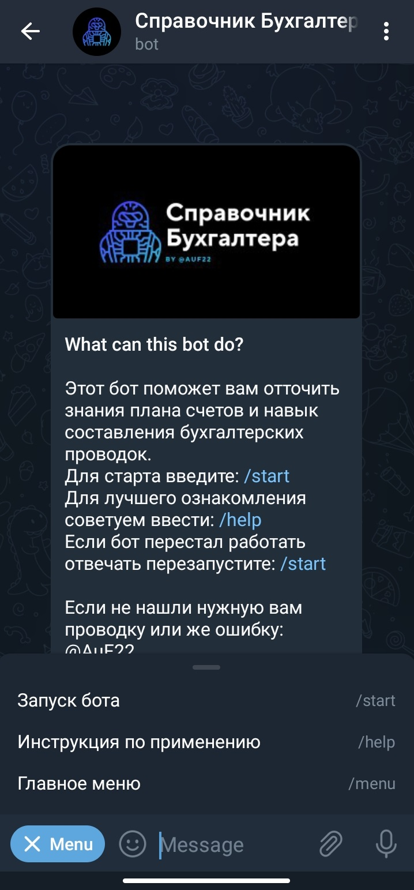
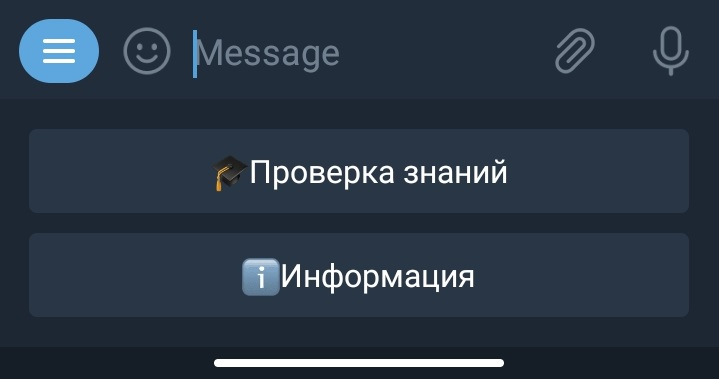
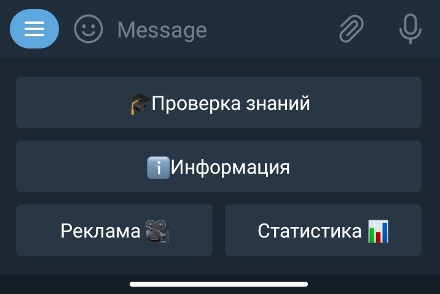

# [Справочник бухгалтера](https://t.me/accountOBU_bot)
## __Telegram Bot by AuF__

---
+ ## RU
Данного бота я сделал для получения большого опыта в программирование.
Создавая данный проект я столкнулся с новыми и старыми проблемами, но которые я смог 
в полной мере решить. Тем кто понимает частично кодинг, надеюсь вы оцените мои
старания и соблюдения стандартам ``PEP8``.

В дальнейшем я буду дальше развивать этот проект добавляя больше возможностей и улучшая 
уже имеющиеся способности бота.

Можете посмотреть как я писал примерно такого же бота раннее после 2-х месяцев обучения
``Python3``
Находится в папке ``old_bot``. И сравнить с тем как я пишу сейчас.

___
##### Небольшая рекомендация
___
>Data/config/config.py
```doctest
import os
from dotenv import load_dotenv

load_dotenv()

admins_id = [os.getenv('Your_list_of_admins')]
API_KEY = os.getenv('Your_API')
```

В этой части советую создать файл переменной окружения ``.env`` и сохранить свои данные
внутри неё для вашей безопасности, но можете передать и напрямую

Создавать же данный файл нужно в следующем путе: ``Data/config/.env``

---
- ### __Начало__

---


Первое что вы видите при запуске данного бота.

---
- ### __User Panel__

---


Таким образом выглядит панель кнопок у обычного пользователя.

---
- ### __Admin Panel__

---


Данным образом выглядит панель у админов бота.

>Панель кнопок подготавливается в следующем файле
>>keyboards/default/start_kb.py
```doctest
from aiogram.types import ReplyKeyboardMarkup, KeyboardButton

# Полный список кнопок
keyboard = [
    [
        KeyboardButton(text='🎓Проверка знаний')
    ],
    [
        KeyboardButton(text='ℹ️Информация')
    ],
    [
        KeyboardButton(text='Реклама 🎥'),
        KeyboardButton(text='Статистика 📊')
    ]
]

# Список кнопок для обычных пользователей
start_kb = ReplyKeyboardMarkup(row_width=2,
                               keyboard=keyboard[:-1],
                               resize_keyboard=True
                               )
# Список кнопок для админов
admin_kb = ReplyKeyboardMarkup(row_width=2,
                               keyboard=keyboard,
                               resize_keyboard=True
                               )
```
Обрез списка ``keyboard[:-1]`` мы получаем из массива все элементы кроме последнего.
В целом объекты ``start_kb`` и ``admin_kb`` называть списком неправильно. Они являются
экземплярами класса ``ReplyKeyboardMurkup``, который в свою очередь возвращает словарь.
И внутри этого словаря в ключе ``keyboard`` лежит наш список с кнопочками. 


- ### Рассылка
>handlers/admins/admin.py
```doctest
@dp.message_handler(state=State_Advertising.photo, content_types=types.ContentType.PHOTO)
async def photo_(message: types.Message, state: FSMContext):
    photo_id = message.photo[-1].file_id
    # Обновляем данные фото в памяти
    await state.update_data(photo=photo_id)
    data = await state.get_data()
    # Получаем данные из 
    text = data.get('text')
    photo = data.get('photo')
    text = data.get('text')
    
    id_list = await db.len_user_id()
    i = 0
    # Запускается цикл перебора всех user_id в DB
    for user_id in id_list:
        # Отправляется сообщения пользователям
        await dp.bot.send_photo(chat_id=user_id[0], photo=photo, caption=text)
        i += 1

    await message.answer(text=f'Сообщение доставлено:\n{i=}')
    # Выход из Машино состояния
    await state.finish()
```
Настоятельно вам рекомендую просмотреть Python File находящийся в ``handlers/admins/admin.py``
Так называемая __Машино Состояние.__ 

###### Посмотреть на этого бота сможете нажав на > [OBU_bot](https://t.me/accountOBU_bot) <
Или же перейдя по главному заголовку. 

---
+ ## ENG 
I made this bot to get a lot of experience in programming.
When I was creating the project, I ran into new and old problems, but I decided to handle everything. 
For those who understand this partial coding, I hope you appreciate my
diligence and adherence to __PEP8__ standards.

In the future, I will further develop this project by adding more features and improving
existing bot abilities.

You can see how I wrote about the same bot earlier after two months of training
``Python3``
Be located in the ``old_bot`` folder. And compare how I write now.

___
##### Small recommendation
___
>Data/config/config.py
```doctest
import os
from dotenv import load_dotenv

load_dotenv()

admins_id = [os.getenv('Your_list_of_admins')]
API_KEY = os.getenv('Your_API')
```

In this part, I advise you to create an environment variable file ``.env`` and save your data
inside it for your safety, but you can also pass it directly

You need to create this file in the path: ``Data/config/.env``

---
- ### __The Start__

---


The first thing you see when you start this bot.

---
- ### __User Panel__

---


It is what the button bar looks like for a user.

---
- ### __Admin Panel__

---


It is what the button bar looks like for an admin.

>The button bar has been made in the following file
>>keyboards/default/start_kb.py
```doctest
from aiogram.types import ReplyKeyboardMarkup, KeyboardButton

# Full list of buttons
keyboard = [
    [
        KeyboardButton(text='🎓Проверка знаний')
    ],
    [
        KeyboardButton(text='ℹ️Информация')
    ],
    [
        KeyboardButton(text='Реклама 🎥'),
        KeyboardButton(text='Статистика 📊')
    ]
]

# List of buttons for regular users
start_kb = ReplyKeyboardMarkup(row_width=2,
                                keyboard=keyboard[:-1],
                                resize_keyboard=True
                                )
# List of buttons for admins
admin_kb = ReplyKeyboardMarkup(row_width=2,
                                keyboard=keyboard,
                                resize_keyboard=True
                                )
```
Trimming the list ``keyboard[:-1]`` we get all the elements from the array except the last one.
Objects ``start_kb`` and ``admin_kb`` are wrong to call a list. They are
instances of the ``ReplyKeyboardMurkup`` class, which returns a dictionary.
And inside this dictionary, the ``keyboard`` key is our list of buttons.


- ### Mailloop
>handlers/admins/admin.py
```doctest
@dp.message_handler(state=State_Advertising.photo, content_types=types.ContentType.PHOTO)
async def photo_(message: types.Message, state: FSMContext):
     photo_id = message.photo[-1].file_id
     # Update photo data in memory
     await state.update_data(photo=photo_id)
     data = await state.get_data()
     # Get data from
     text = data.get('text')
     photo = data.get('photo')
     text = data.get('text')
    
     id_list = await db.len_user_id()
     i = 0
     # Run a loop through all user_ids in the DB
     for user_id in id_list:
         # Send messages to users
         await dp.bot.send_photo(chat_id=user_id[0], photo=photo, caption=text)
         i += 1

     await message.answer(text=f'Сообщение доставлено:\n{i=}')
     # Exit Machine State
     await state.finish()
```

I strongly recommend that you look at the Python File located in ``handlers/admins/admin.py``
The so-called __Machine Condition.__
###### You can view this bot by clicking on > [OBU_bot](https://t.me/accountOBU_bot) <
Or by clicking on the main heading.